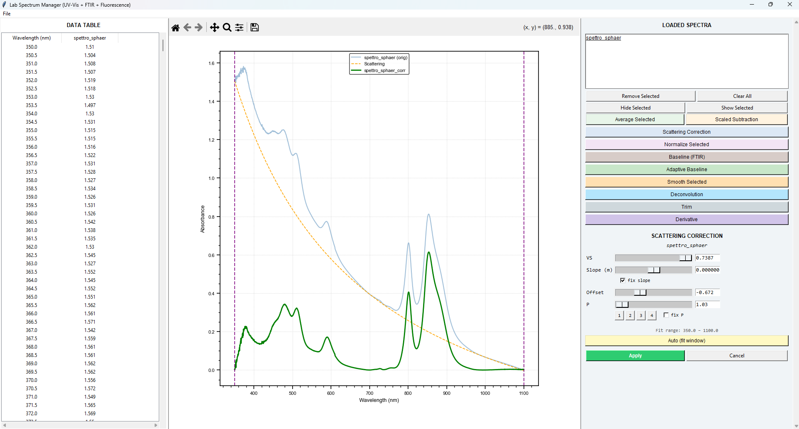

# LabSpectrumManager

Viewer and editor for UV-Vis, FTIR and fluorescence spectra: load, overlay and compare multiple
spectra together, with an interactive cursor on the plot and a set of processing tools —
scattering correction (Rayleigh/Mie), adaptive baseline, scaled subtraction between spectra,
averaging, smoothing (boxcar or Savitzky-Golay) and multi-peak deconvolution
(Lorentzian/Gaussian/pseudo-Voigt).



## Supported formats

| Extension | Type | Notes |
|---|---|---|
| `.dsp` | UV-Vis (binary) | native parser |
| `.sp` | FTIR PerkinElmer (binary) | native parser (no external tool required) |
| `.csv` | UV-Vis or FTIR | type auto-detected from the X-axis values |

Support for other instrument/vendor-specific formats can be added on request — open an issue with
a sample file.

## Dependencies

`numpy`, `pandas`, `matplotlib`, `tkinter` (standard library); `tkinterdnd2` is optional and
enables drag-and-drop file loading; `scipy` is optional and enables the constrained refinement
step in the scattering correction auto-fit (a plain least-squares fallback is used without it).

## Running

```
pythonw LabSpectrumManager.pyw [spectrum_file]
```

## Interface

Three panels side by side: a data table (merged spectra as tab-separated text) on the left, a
Matplotlib graph with an interactive crosshair cursor in the center, and a list of loaded spectra
(multi-select) with metadata on the right.

## Processing tools

- **Scattering correction** — estimates and subtracts a baseline of the form
  `A · 10^VS · (λ/1000)^-P + m·λ + Offset`: the power term models Rayleigh scattering
  (P=4, small particles) or Mie scattering (P=2–3, particles comparable to the wavelength), the
  linear term covers baseline drift unrelated to scattering. Theory and operating procedure in
  [`scattering_correction_theory.md`](scattering_correction_theory.md).
- **Linear baseline** (FTIR) — a two-anchor baseline, draggable on the graph, for FTIR spectra.
- **Adaptive baseline** — a lower envelope via iterated moving averages with a minimum
  constraint, adjustable window via a slider (from "flat" to "hugging the signal").
- **Scaled subtraction** — subtracts a reference spectrum B from a spectrum A with an adjustable
  coefficient `k` (`Result = A − k × B`), useful for removing a solvent/blank contribution.
- **Average** of several selected spectra.
- **Smoothing** — repeated moving average (boxcar, ~Gaussian) or Savitzky-Golay filter (local
  polynomial fit, better preserves peak height and shape).
- **Deconvolution** — interactive multi-peak fit (click to add/remove a peak) with a
  Lorentzian, Gaussian or pseudo-Voigt profile.

## Structure

- `LabSpectrumManager.pyw` — main application (a single `LabSpectrumManager` class)
- `old version and side projects/` — earlier versions (v0-v2) and side projects
  (`scattering.pyw`, `spc_plotter.pyw`) kept as historical reference
- `test_sp_reader.py` — test for the native `.sp` parser (FTIR PerkinElmer)
