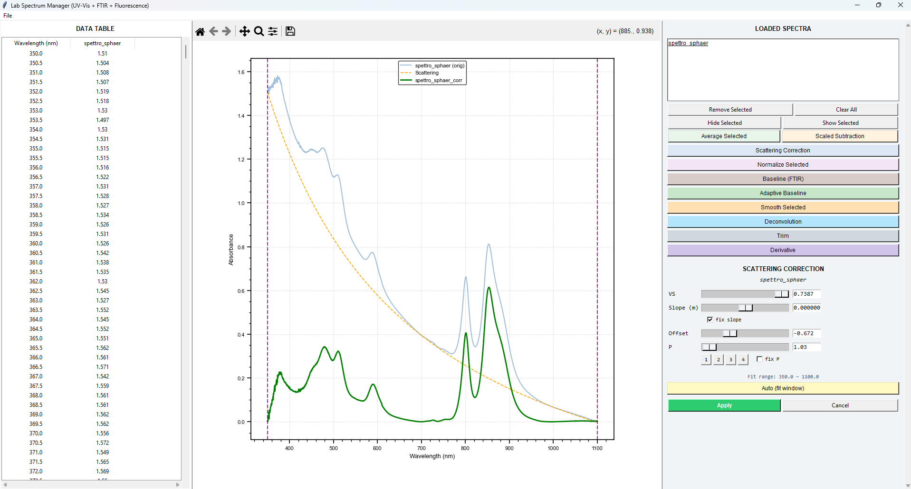

# LabSpectrumManager

Viewer and editor for UV-Vis, FTIR and fluorescence spectra: load, overlay and compare multiple
spectra together, with an interactive cursor on the plot and a set of processing tools —
scattering correction (Rayleigh/Mie), adaptive baseline, scaled subtraction between spectra,
averaging, smoothing (boxcar or Savitzky-Golay) and multi-peak deconvolution
(Lorentzian/Gaussian/pseudo-Voigt).



## Supported formats

| Extension | Type | Notes |
|---|---|---|
| `.dsp` | UV-Vis (binary) | native parser |
| `.sp` | FTIR PerkinElmer (binary) | native parser (no external tool required) |
| `.csv` | UV-Vis or FTIR | type auto-detected from the X-axis values |
| `.csv` | UV-Vis (BMG plate reader) | absorbance spectra per well; detected from the header — see [BMG plate-reader CSV](#bmg-plate-reader-csv) |

Support for other instrument/vendor-specific formats can be added on request — open an issue with
a sample file.

## BMG plate-reader CSV

A `.csv` exported by a **BMG** microplate reader (the sample files came from a BMG Omega, with
the data folder `...\BMG\Omega\User\Data` in the header) holding **absorbance spectra, one per
well**. It is recognised by `Test run no.:` in the first lines and read by `_leggi_csv_bmg()`.
Tests: `tests/test_bmg_reader.py`.

### File layout

Text file, `;` separator, CRLF line ends, `.` as decimal separator in the files seen so far. One
row of metadata per line, then the table:

```
User: USER;Path: C:\...\BMG\Omega\User\Data;Test run no.: 459
Test name: 350_1000_sp;Date: 03/07/2025;Time: 17:02:38
                                                   <- blank line
ID1: <experiment name>;                            <- line 4
Absorbance spectrum
                                                   <- blank line
Raw Data  (Abs Spectrum)#                          <- or "Blank corrected based on Raw Data   (Abs Spectrum)#"
                                                   <- blank line
 Well; Content; 1 - 1; 1 - 1; ...                  <- one "1 - 1" per wavelength (ignored)
;Wavelength [nm];350;351;352;...;1000;             <- 651 points, 1 nm step in the sample
A01;Blank B;0.322;0.320;...                        <- one row per well: id; content; one value per wavelength
A02;Sample X1;0.384;0.381;...
```

Every table row — the `Well; Content` row, the `Wavelength` row and the data rows — ends with a
trailing `;`, so each has `2 + number of wavelengths + 1` fields (654 for 651 wavelengths).
The metadata lines have no fixed position apart from being above the `;Wavelength [nm]` row:
the reader looks for that row instead of counting lines.

### Raw and blank-corrected exports

The same run can be exported twice:

- **Raw data** — every well has its values, including the `Blank` wells.
- **Blank corrected** — the `Blank` rows are **present but empty** (all fields blank), and each
  sample is `sample − mean of all the blank wells` (the mean over the blank wells of the whole
  plate, *not* the blank in the same row: for sample `A02` the blank `A01` alone gives a
  different result). Checked on one export (3 samples, 3 blanks, 350–1000 nm): subtracting the
  mean of the raw blanks reproduces the software's corrected values to within 0.001, i.e. the
  3-decimal rounding of the file. So the raw file is enough to obtain the corrected spectra.

### How LabSpectrumManager reads it

- Each well with data becomes one spectrum, named `<file name>_<well>` (e.g. `run_A02`); the
  well content (`Sample X1`), experiment name (`ID1`), test name and run number, date and time,
  the "Raw Data / Blank corrected" line and the instrument appear in the metadata panel.
- Spectra are typed **UV-Vis** (X axis in nm).
- **Raw file with `Blank` wells:** a dialog asks whether to subtract the mean of the blanks. *Yes*
  loads only the samples, already corrected; *No* loads samples and blanks as they are.
- **Blank-corrected file:** the empty blank rows are skipped, nothing is asked.
- Empty cells are dropped; a decimal comma is accepted; the file is read as `latin-1` like the
  other CSV readers.
- A well whose content starts with `Blank` is treated as a blank, anything else as a sample. If a
  file contains only blanks they are loaded as ordinary spectra.

### Limits

Only one export has been inspected, with a single plate, a single measurement per well and only the
contents `Sample` and `Blank`. Not covered, because they were never seen: other well types
(standards, controls — they would be loaded as samples), several plates or repeated cycles in one
file, fluorescence or luminescence exports (the header says `Absorbance spectrum`), and a Time
or Date written in another locale format (shown as found). If a file does not load, send the first
10–15 lines of the export — the header and two data rows are enough to adapt the reader.

## Dependencies

`numpy`, `pandas`, `matplotlib`, `tkinter` (standard library); `tkinterdnd2` is optional and
enables drag-and-drop file loading; `scipy` is optional and enables the constrained refinement
step in the scattering correction auto-fit (a plain least-squares fallback is used without it).
[PlotStyleKit](https://github.com/milanone/PlotStyleKit) is an optional sibling repo (cloned as
`../PlotStyleKit` next to this project) providing the shared Origin-like plot style and the
standalone figure editor behind `File → Save Figure (pickle)` / `File → Edit Figure...`; without
it those two menu items are unavailable and the app uses default matplotlib styling.

## Running

```
pythonw LabSpectrumManager.pyw [spectrum_file]
```

## Interface

Three panels side by side: a data table of the merged spectra on the left, a Matplotlib graph
with an interactive crosshair cursor in the center, and a list of loaded spectra (multi-select)
with metadata on the right — which scrolls vertically, since some tool panels (Deconvolution)
can need more room than the window has. The X/Y readout that follows the cursor picks its corner
automatically to avoid the plotted curves, and can be dragged anywhere on the graph.

The data table's columns (one per spectrum, plus X) can be resized by dragging their border, and
the table scrolls both ways once there are more columns or rows than fit. Select rows (click,
Shift/Ctrl to extend, Ctrl+A for all) and Ctrl+C — or right-click — to copy them, header included,
tab-separated, ready to paste into Excel/Origin.

Any spectrum can be hidden from the graph (Hide Selected / Show Selected, or right-click in the
list) without removing it — it stays in the list (greyed out), data table and metadata, just off
the plot. Closing the app (window close button or `File → Exit`) asks for confirmation if there
are calculated results — averages, fits, corrections, trims, pasted data — that haven't been
exported yet with `File → Export CSV` or saved with `File → Save Session...`.

`File → Save Session...` saves everything currently loaded — every spectrum, including ones
derived from a processing tool (scattering correction, baseline, smoothing, fit, trim, average,
...) — to a single `.lsmsession` file, so the work can be resumed later instead of redone step by
step. `File → Open Session...` reloads it, replacing what's currently loaded. Each processing
panel must be closed (Apply or Cancel) before saving, with one exception: Deconvolution can be
saved mid-fit — peaks, fit range, profile and offset not yet applied — and reopening the session
restores the panel to that exact state so the fit can be resumed.

`File → Save Figure (pickle)` saves the current graph as a live, re-editable `Figure` object
(not a raster image); `File → Edit Figure...` opens it directly in PlotStyleKit's figure editor
for titles, axis labels, per-line styling, legend placement and publication-size PNG/SVG/PDF
export — see Dependencies.

## Processing tools

- **Scattering correction** — estimates and subtracts a baseline of the form
  `VS · (λ/1000)^-P − M·λ + Offset`, with a constrained auto-fit (SLSQP) over the whole spectrum
  by default: the power term models Rayleigh (P≈4, small particles) to Mie (P down to 1, large
  particles) scattering, the linear term covers residual baseline drift unrelated to scattering
  and is fixed at zero unless unlocked. Theory and operating procedure in
  [`scattering_correction_theory.md`](scattering_correction_theory.md).
- **Linear baseline** (FTIR) — a two-anchor baseline, draggable on the graph, for FTIR spectra.
- **Adaptive baseline** — a lower envelope via iterated moving averages with a minimum
  constraint, adjustable window via a slider (from "flat" to "hugging the signal").
- **Scaled subtraction** — subtracts a reference spectrum B from a spectrum A with an adjustable
  coefficient `k` (`Result = A − k × B`), useful for removing a solvent/blank contribution.
- **Average** of several selected spectra.
- **Smoothing** — repeated moving average (boxcar, ~Gaussian) or Savitzky-Golay filter (local
  polynomial fit, better preserves peak height and shape).
- **Derivative** — 1st or 2nd derivative via Savitzky-Golay (exact derivative of a local
  polynomial fit, in real X units), with the same adjustable smoothing/polynomial-order controls
  as Smoothing, useful for resolving overlapping bands or removing a sloping baseline.
- **Deconvolution** — interactive multi-peak fit (click to add/remove a peak) with a
  Lorentzian, Gaussian or pseudo-Voigt profile; the fit is restricted to a window settable by
  dragging its two boundary lines or typing exact values, same as Trim below.
- **Trim** — crops a spectrum to a window (drag the two vertical lines, or type exact start/end
  values) and stores the selected portion as a new, independent spectrum, leaving the source
  trace untouched; the window edges always snap to a real data point.

## Structure

- `LabSpectrumManager.pyw` — main application (a single `LabSpectrumManager` class)
- `old version and side projects/` — earlier versions (v0-v2) and side projects
  (`scattering.pyw`, `spc_plotter.pyw`) kept as historical reference
- `test_sp_reader.py` — test for the native `.sp` parser (FTIR PerkinElmer)
- `tests/test_bmg_reader.py` — unit tests for the BMG plate-reader CSV reader (synthetic files;
  run with `python -m unittest discover -s tests -v`)

## License

[MIT](LICENSE)
